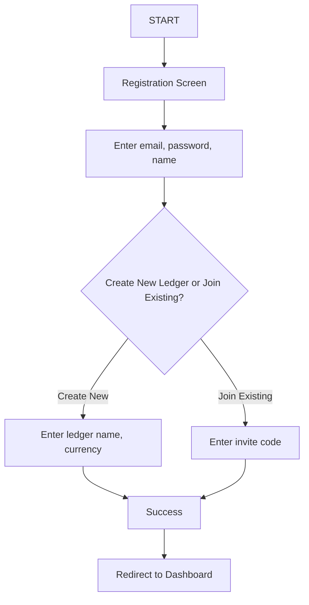
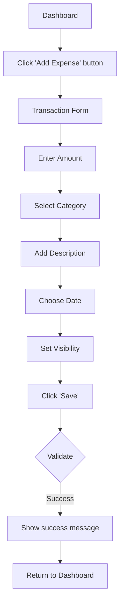
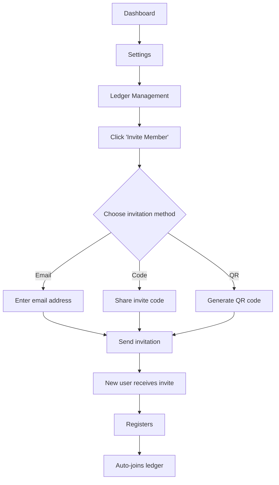
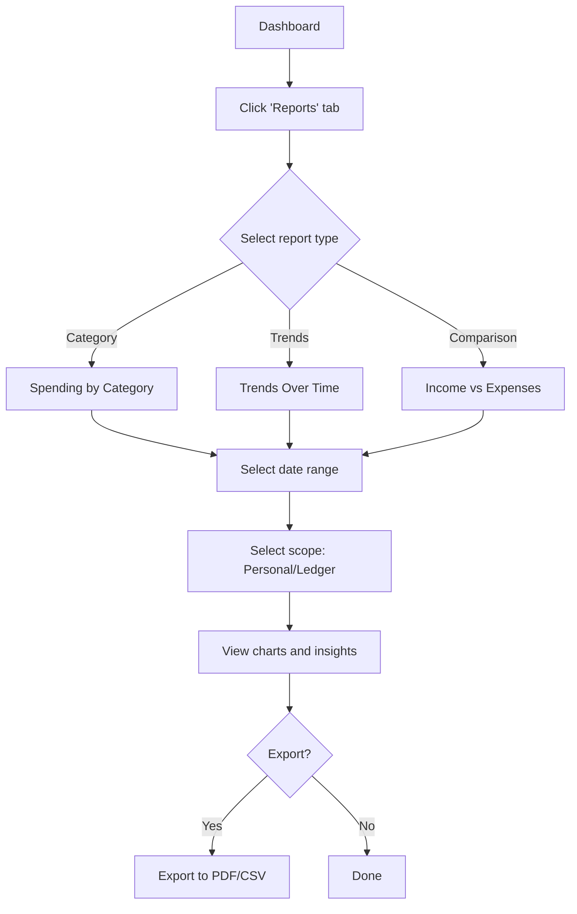
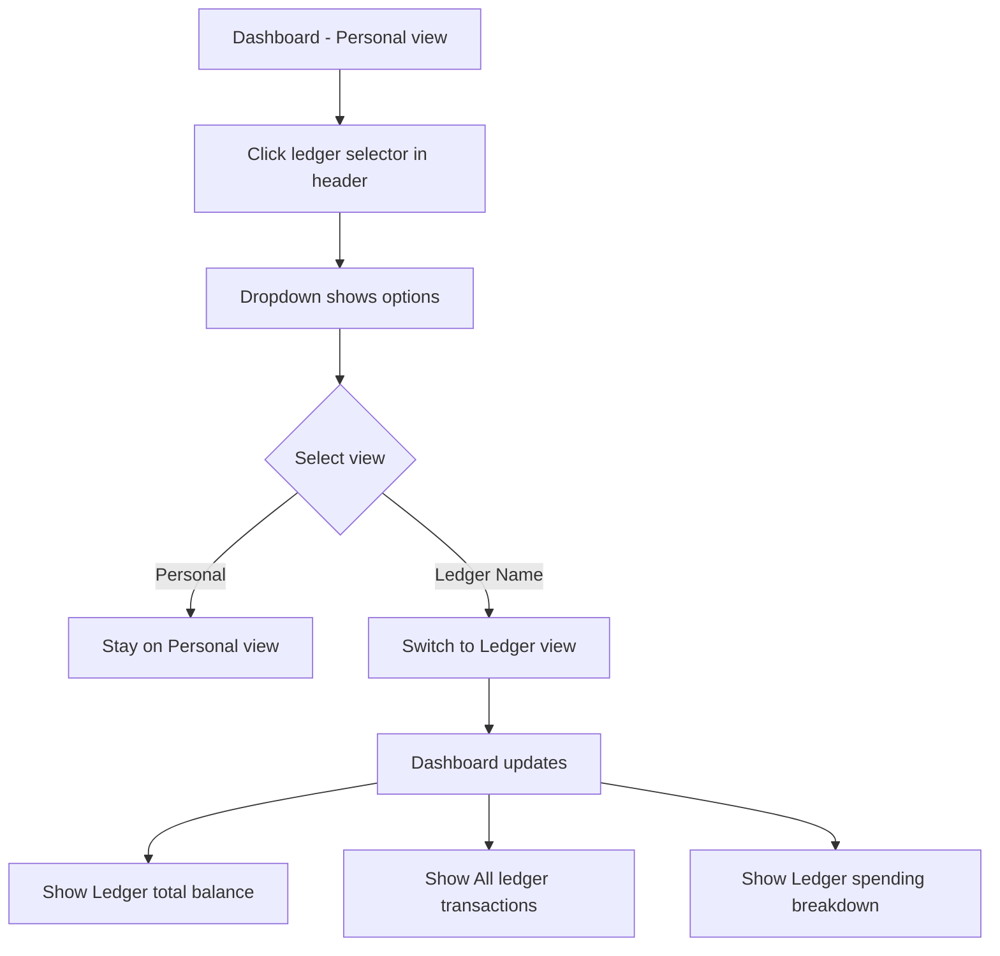

# Product Specification - S-ACCT-BOOKS

## Executive Summary

S-ACCT-BOOKS is a shared family accounting application that enables family members to track personal and shared finances collaboratively. Users can log daily expenses and income via web or mobile, view personal financial history, and access aggregated ledger-wide financial insights. Users can belong to multiple ledgers (e.g., personal, family, roommates).

**Target Users:** Families, roommates, couples, or any small group that shares expenses and wants financial transparency.

**Core Value Proposition:** Simplified shared expense tracking with individual privacy controls and comprehensive family financial visibility.

## User Personas

### Primary Persona: Sarah (Ledger Owner)
- 35-year-old parent managing household finances
- Wants to track family spending and create budgets
- Needs visibility into all family expenses
- Uses primarily web app for detailed reports, mobile for quick checks

### Secondary Persona: Mike (Ledger Member)
- 16-year-old teenager with allowance
- Logs personal expenses via mobile app
- Wants privacy for personal purchases
- Occasionally checks spending trends

### Tertiary Persona: Roommate Group
- 3-4 young professionals sharing apartment
- Split shared expenses (rent, utilities, groceries)
- Track personal vs shared spending
- Need equal visibility and admin rights

## User Stories

### Authentication & Onboarding
- As a new user, I want to register with email/password so I can create an account
- As a new user, I want to create a new ledger during signup so my family can join
- As an existing user, I want to log in securely so I can access my financial data
- As a ledger admin, I want to invite family members via email/code so they can join my ledger
- As an invited user, I want to accept a ledger invitation so I can join my family's ledger

### Transaction Management
- As a user, I want to log an expense with amount, category, and notes so I can track my spending
- As a user, I want to log income so I can see my total cash flow
- As a user, I want to edit/delete my transactions so I can fix mistakes
- As a user, I want to attach receipts to transactions so I have proof of purchase (Phase 5)
- As a user, I want to mark transactions as "shared" so the ledger members know it's a common expense
- As a user, I want to categorize transactions so I can analyze spending by category

### Dashboard & Viewing
- As a user, I want to see my current balance at a glance
- As a user, I want to view recent transactions in chronological order
- As a user, I want to filter transactions by date, category, or type
- As a user, I want to search transactions by description
- As a ledger member, I want to switch between personal and ledger view

### Ledger Features
- As a ledger admin, I want to view all ledger members so I can manage the ledger
- As a ledger admin, I want to remove members if needed
- As a ledger member, I want to see aggregated ledger spending
- As a ledger member, I want to see who spent what (if privacy settings allow)
- As a user, I want to control whether my transactions are visible to the ledger

### Reports & Analytics
- As a user, I want to see spending breakdown by category in a pie chart
- As a user, I want to see spending trends over time in a line chart
- As a user, I want to export my data to CSV/PDF for tax purposes
- As a user, I want to compare spending across different time periods
- As a ledger admin, I want to see which categories the family spends most on

### Budgets (Phase 4)
- As a user, I want to set monthly budget limits per category
- As a user, I want to receive notifications when approaching budget limit
- As a ledger admin, I want to set family-wide budget goals

## Core Features by Priority

### Must Have (MVP - Phase 1)
1. User registration and authentication (JWT-based)
2. Ledger creation
3. Add/edit/delete transactions (expense and income)
4. Transaction categorization (predefined categories)
5. Dashboard with balance and recent transactions
6. Transaction list with basic filtering (date, type, category)
7. User profile and settings
8. Responsive web interface

### Should Have (Phase 2-3)
1. Android mobile app with feature parity
2. Ledger invitation system
3. Multi-user ledger support with roles
4. Shared ledger dashboard
5. Aggregated ledger financial views
6. Privacy controls (personal vs shared transactions)
7. Offline support in mobile app

### Could Have (Phase 4-5)
1. Charts and visual analytics
2. Custom date range reports
3. Budget limits and alerts
4. Multi-currency support
5. Recurring transactions
6. Receipt photo uploads
7. Export to PDF/CSV
8. Push notifications (mobile)
9. Email notifications

### Won't Have (Out of Scope for V1)
1. Bank account integration
2. Investment tracking
3. Bill payment functionality
4. Cryptocurrency tracking
5. Tax preparation features
6. Loan/debt management

## User Flows

### Flow 1: New User Registration & Ledger Creation

```
START → Registration Screen
  ↓
Enter email, password, name
  ↓
Create New Ledger or Join Existing
  ↓ (Create New)
Enter ledger name, currency
  ↓
Success → Redirect to Dashboard
```



### Flow 2: Adding an Expense

```
Dashboard → Click "Add Expense" button
  ↓
Transaction Form
  - Amount (required)
  - Category (dropdown, required)
  - Description (optional)
  - Date (default: today)
  - Type: Expense/Income
  - Visibility: Personal/Shared (toggle)
  - Receipt (optional, Phase 5)
  ↓
Click "Save"
  ↓
Validate → Show success message
  ↓
Return to Dashboard (transaction appears in list)
```



### Flow 3: Inviting Family Member

```
Dashboard → Settings → Ledger Management
  ↓
Click "Invite Member"
  ↓
Choose invitation method:
  - Email (enter email address)
  - Share invite code
  - Generate QR code
  ↓
Send invitation
  ↓
New user receives invite → Registers → Auto-joins ledger
```



### Flow 4: Viewing Reports

```
Dashboard → Click "Reports" tab
  ↓
Select report type:
  - Spending by Category
  - Trends Over Time
  - Income vs Expenses
  ↓
Select date range (this month, last 3 months, custom)
  ↓
Select scope: Personal or Ledger
  ↓
View charts and insights
  ↓
(Optional) Export to PDF/CSV
```



### Flow 5: Switching Between Personal and Ledger View

```
Dashboard (Personal view by default)
  ↓
User clicks ledger selector in header
  ↓
Dropdown shows: "Personal" | "Ledger Name"
  ↓
Select "Ledger Name"
  ↓
Dashboard updates to show:
  - Ledger total balance
  - All ledger transactions
  - Ledger spending breakdown
```



## Screen Specifications

### 1. Authentication Screens

**Login Screen**
- Email input field
- Password input field (with show/hide toggle)
- "Remember me" checkbox
- "Login" button (primary action)
- "Forgot password?" link
- "Don't have an account? Sign up" link

**Registration Screen**
- Name input field
- Email input field
- Password input field (with strength indicator)
- Confirm password input field
- "Sign Up" button
- "Already have an account? Login" link
- After signup → "Create or Join Ledger" modal

**Create/Join Ledger Modal**
- Two tabs: "Create New Ledger" | "Join Existing"
- Create tab:
  - Ledger name input
  - Currency selector (dropdown)
  - "Create Ledger" button
- Join tab:
  - Invite code input
  - "Join Ledger" button

### 2. Dashboard (Main Screen)

**Header Section**
- App logo/name
- Ledger selector dropdown (user can belong to multiple ledgers)
- User profile icon (click → settings menu)
- Notification icon (future)

**Balance Card (Top)**
- Large display: Current balance (income - expenses)
- Trend indicator (up/down arrow with percentage)
- Period selector: "This Month" | "This Year" | "All Time"
- Quick stats: Total Income | Total Expenses

**Action Buttons**
- Primary: "Add Expense" (floating action button on mobile)
- Secondary: "Add Income"

**Recent Transactions Section**
- List of last 10 transactions
- Each transaction card shows:
  - Category icon and name
  - Description
  - Amount (green for income, red for expense)
  - Date
  - Edit/delete icons (on hover/long press)
- "View All" link at bottom

**Bottom Navigation (Mobile Only)**
- Dashboard | Transactions | Reports | Settings

**Sidebar Navigation (Web Only)**
- Dashboard
- Transactions
- Reports
- Ledger Management
- Settings

### 3. Transaction List Screen

**Filter Section (Collapsible)**
- Date range picker (start date, end date)
- Category multi-select dropdown
- Type: All | Expenses | Income
- Visibility: All | Personal | Shared
- "Apply Filters" button | "Reset" button

**Transaction List**
- Grouped by date (Today, Yesterday, This Week, etc.)
- Each transaction shows:
  - Category icon
  - Description
  - Amount with color coding
  - Date and time
  - Shared/personal badge
  - Click to open detail view/edit modal

**Pagination or Infinite Scroll**

### 4. Add/Edit Transaction Screen (Modal or Full Screen)

**Form Fields**
- Amount input (large, focused on open)
- Type toggle: Expense | Income
- Category selector (grid of icons or dropdown)
- Description text field
- Date picker (default: today)
- Visibility toggle: Personal | Shared (if in ledger)
- Receipt attachment (Phase 5): Camera or file upload

**Actions**
- "Save" button (primary)
- "Cancel" button
- "Delete" button (if editing existing)

### 5. Reports Screen

**Report Type Selector (Tabs)**
- Overview
- Category Breakdown
- Trends
- Comparison

**Filters**
- Date range selector
- Scope: Personal | Ledger
- Categories (include/exclude)

**Overview Tab**
- Total income vs expenses (bar chart)
- Net change (income - expenses)
- Category breakdown (pie chart)
- Top spending categories (list)

**Category Breakdown Tab**
- Pie chart: spending by category
- List view with percentages
- Click category → see transactions

**Trends Tab**
- Line chart: spending over time
- Selectable metrics: Total, Average, Category
- Trend direction and insights

**Comparison Tab (Future)**
- Compare current period to previous
- Year-over-year comparison

### 6. Ledger Management Screen

**Ledger Info Section**
- Ledger name
- Creation date
- Currency
- Total members

**Members List**
- Each member card shows:
  - Name
  - Email
  - Role: Admin | Member
  - Total transactions count
  - Actions (admin only): Remove, Change role

**Invitation Section**
- "Invite New Member" button
- Active invitations list (pending)
- Option to resend or revoke invitation

**Ledger Settings**
- Rename ledger
- Change default currency
- Privacy settings
- Leave ledger (members) / Delete ledger (owner)

### 7. Settings Screen

**Account Section**
- Profile picture
- Name (editable)
- Email (editable)
- Change password

**Preferences**
- Default transaction type (expense/income)
- Default visibility (personal/shared)
- Date format
- Number format
- Theme (light/dark)

**Notifications** (Phase 4)
- Push notifications toggle
- Email notifications toggle
- Budget alert preferences

**Data**
- Export all data (CSV/JSON)
- Delete account

**About**
- App version
- Terms of service
- Privacy policy
- Contact support

## Design Guidelines for Figma

### Color Palette

**Primary Colors**
- Primary: #1976D2 (Blue) - for primary actions, links
- Secondary: #424242 (Dark Gray) - for secondary text, borders

**Semantic Colors**
- Success/Income: #4CAF50 (Green)
- Error/Expense: #F44336 (Red)
- Warning/Budget Alert: #FF9800 (Orange)
- Info: #2196F3 (Light Blue)

**Neutral Colors**
- Background: #FAFAFA (Light Gray)
- Surface: #FFFFFF (White)
- Text Primary: #212121 (Almost Black)
- Text Secondary: #757575 (Gray)
- Divider: #E0E0E0 (Light Gray)

### Typography

**Font Family:** Inter or Roboto (Material Design standard)

**Scale:**
- H1 (Page Title): 32px, Bold
- H2 (Section Title): 24px, Semi-Bold
- H3 (Card Title): 20px, Semi-Bold
- Body Large: 16px, Regular
- Body: 14px, Regular
- Caption: 12px, Regular
- Button: 14px, Medium, Uppercase

### Spacing System (8px base unit)

- XXS: 4px
- XS: 8px
- S: 12px
- M: 16px
- L: 24px
- XL: 32px
- XXL: 48px
- XXXL: 64px

### Component Library (Material Design 3)

**Buttons**
- Primary: Filled button (primary color)
- Secondary: Outlined button
- Tertiary: Text button
- Floating Action Button (FAB) for quick add

**Input Fields**
- Outlined text fields
- Dropdown/select with Material dropdown style
- Date picker with calendar UI
- Toggle switches for binary options

**Cards**
- Elevation: 1-2dp for cards
- Border radius: 8px
- Padding: 16px

**Icons**
- Use Material Icons or similar icon set
- Category icons should be colorful and distinctive

### Responsive Breakpoints

- Mobile: < 640px
- Tablet: 640px - 1024px
- Desktop: > 1024px

### Accessibility

- Minimum contrast ratio: 4.5:1 for text
- Touch targets: minimum 44x44px
- Keyboard navigation support
- Screen reader labels for all interactive elements

## Figma Design Deliverables Checklist

### Phase 1: Wireframes
- [ ] User flow diagrams
- [ ] Low-fidelity wireframes for all core screens
- [ ] Navigation structure
- [ ] Responsive layouts (mobile, tablet, desktop)

### Phase 2: High-Fidelity Mockups
- [ ] Design system/component library
- [ ] All screens in light mode
- [ ] All screens in dark mode (optional for MVP)
- [ ] Micro-interactions and animations
- [ ] Loading and error states
- [ ] Empty states

### Phase 3: Prototype
- [ ] Interactive prototype with navigation
- [ ] Key user flows clickable
- [ ] Transition animations
- [ ] User testing ready

### Phase 4: Design Specs
- [ ] Export design tokens (colors, typography, spacing)
- [ ] Component specifications
- [ ] Developer handoff documentation
- [ ] Asset exports (icons, images)

## Technical Considerations

### Performance Targets
- Initial page load: < 3 seconds
- Transaction save: < 1 second
- Dashboard data fetch: < 2 seconds
- Mobile app launch: < 2 seconds

### Security Requirements
- HTTPS only
- JWT token expiration: 15 minutes (access) / 7 days (refresh)
- Password requirements: 8+ characters, mix of letters/numbers
- Rate limiting on API endpoints
- Input sanitization and validation
- CORS configuration
- XSS and CSRF protection

### Data Privacy
- Users only see ledgers they have access to
- Personal transactions can be hidden from ledger view
- Admin cannot edit other users' transactions
- Data deletion on account removal (or anonymization)

### Browser/Platform Support
- Web: Chrome, Firefox, Safari, Edge (latest 2 versions)
- Android: API 24+ (Android 7.0+)
- Future: iOS 14+

## Success Metrics

### User Acquisition
- Number of registered users
- Number of active ledgers
- Invitation acceptance rate

### Engagement
- Daily active users (DAU)
- Transactions logged per user per month
- Session duration
- Feature usage (reports, budgets, etc.)

### Retention
- 7-day retention rate
- 30-day retention rate
- Churn rate

### Technical
- API response time
- Error rate
- App crash rate (mobile)
- Uptime percentage

## Open Questions for Product Definition

1. **Privacy Model:** Should ledger admins see all transactions or only "shared" ones?
2. **Transaction Ownership:** Can admin edit/delete other members' transactions?
3. **Ledger Limits:** Maximum members per ledger? Maximum transactions per month?
4. **Categories:** Fixed list or user-customizable? Allow custom category creation?
5. **Data Retention:** How long to keep transaction history? Archival strategy?
6. **Monetization:** Free tier limits? Paid features? Freemium model?
7. **Social Features:** Comments on transactions? Likes? Activity feed?
8. **Receipt Storage:** Size limits? Storage service (S3, Firebase Storage)?
9. **Localization:** Multi-language support from day 1?
10. **Invitation Security:** Expiration time for invite codes? One-time use?

## Next Steps

1. Review and finalize product specification
2. Answer open questions with stakeholders
3. Create Figma designs based on this spec
4. Validate designs with potential users
5. Begin technical implementation (see IMPLEMENTATION_ROADMAP.md)
